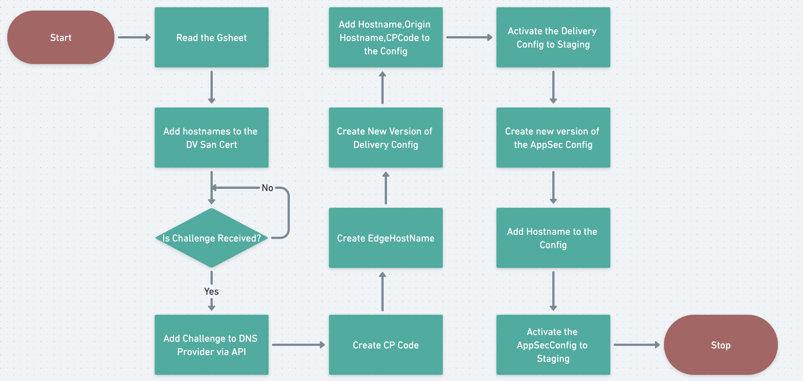

# Akamai Onboarding of Internal Domains
This repositry contains the code to bulk onboard any number of domains onto Akamai CDN in an automated way. 

### Features
- Certificate Creation in the Akamai CPS.
- Domain Validation using Godaddy APIs.
- Create / Clone the Delivery Configs.
- Create / Clone the AppSec Configs.
- Update the Certificates,Delivery Configs, Appsec Configs.
- Activation of the Certificates,Delivery Configs, Appsec Configs.

### Environment Setup


### Credentials Setup
In order to use this configuration, you need to:
* Set up your credential files as described in [here](https://techdocs.akamai.com/developer/docs/set-up-authentication-credentials)
* When working through this process you need to give grants for the property manager API,CPS API,Edgehostnames API,Application Security API (if you will want to move properties).  
* Setup Google Sheet API as describer in [here](https://www.evernote.com/shard/s222/sh/42e72b36-12c4-a0f4-0a3d-a225fa9157d7/5392dce76d0eae0b6fd7dcbf9aa22ca3)
* Rename templateconfig.ini to config.ini and udpate the credentials.


### Install pip packages needed
```
$ pip install -r requirements.txt
```

### Workflow


### Create Certificate
```
$python -m srcfiles.cps.createCert --logfile logs/cpslog --accountSwitchKey 1-6JHGX --contractId 1-1NC95D --file srcfiles/cps/enrollment_data.json
Successfully created the Enrollment and Enrollment Id is 159548
Waiting for the DNS Challenges to be Received..
Waiting for the DNS Challenges to be Received..
Waiting for the DNS Challenges to be Received..
Waiting for the DNS Challenges to be Received..
Waiting for the DNS Challenges to be Received..
Waiting for the DNS Challenges to be Received..
Waiting for the DNS Challenges to be Received..
Waiting for the DNS Challenges to be Received..
Waiting for the DNS Challenges to be Received..
DNS Record:_acme-challenge.joffreybaratheon.iamacmp.com.
Token:VZ6BHNpOVzRYHacQxt69eK4w_9oyZfqX-4BbV8Kl8IA
********************************************************************************
{
  "_acme-challenge.joffreybaratheon.iamacmp.com.": "VZ6BHNpOVzRYHacQxt69eK4w_9oyZfqX-4BbV8Kl8IA"
}
The status of adding record _acme-challenge.joffreybaratheon.iamacmp.com. to DNSZone is True

```

### Create a Config
```
$:python -m srcfiles.propertymanager.cloneConfig.py --clone False --logfile configlog --accountSwitchKey 1-6JHGX --contractId ctr_1-1NC95D --groupId grp_223702 --newPropertyName GotTemplate 
Succesfully Created the config and property Id is 838634.
$:
```
- Add a temporary hostname example.edgesuite.net
- Add a temporary origin hostname and select Akamai managed Certificate Store
- Add a CP Code
- Add a blank rule called Static Origins in the config.
- Make the necessary changes in the config to be used as a template. 

 
 
  
 


### Clone the Config
```
$:python -m srcfiles.propertymanager.cloneConfig --clone True --logfile configlog --accountSwitchKey 1-6JHGX --contractId ctr_1-1NC95D --groupId grp_223702 --propertyId prp_838658 --version 1 --newPropertyName ToiDemo --hostName 'joffreybaratheon.iamacmp.com' --certEnrollmentId 159548 --originHostname timesofindia.indiatimes.com
Succesfully Cloned the config and property Id is 838659.
$:
``` 
 
 


### Create the Security Config
```
$:python -m srcfiles.ksd.ksdCreate --logfile ksdlog --accountSwitchKey 1-6JHGX --groupId 223702 --contractId 1-1NC95D --securityPolicyName Policy1 --hostnames 'joffreybaratheon.iamacmp.com' --name ToiDemo
Succesfully Created the App Sec Config and the config Id is 87054 and Policy Id is fhd_188004
$:
```
\
- Make the necessary changes in the config to be used as a template. \
 \

### Onboarding Workflow


### Onboarding onto Existing Configs
```
$python onboard.py --sheet 'First Batch' --start 3 --end 3 --accountSwitchKey 1-6JHGX --ChangeID 'TimesPOCDemo1: Third Batch Hostnames Addition' --logfile onboard.txt --addHostnameAppSec False
```
```
python onboard.py --sheet 'First Batch' --start 3 --end 3 --accountSwitchKey 1-6JHGX --ChangeID 'TimesPOCDemo1: Third Batch Hostnames Addition' --logfile onboard.txt --addHostnameAppSec True
```